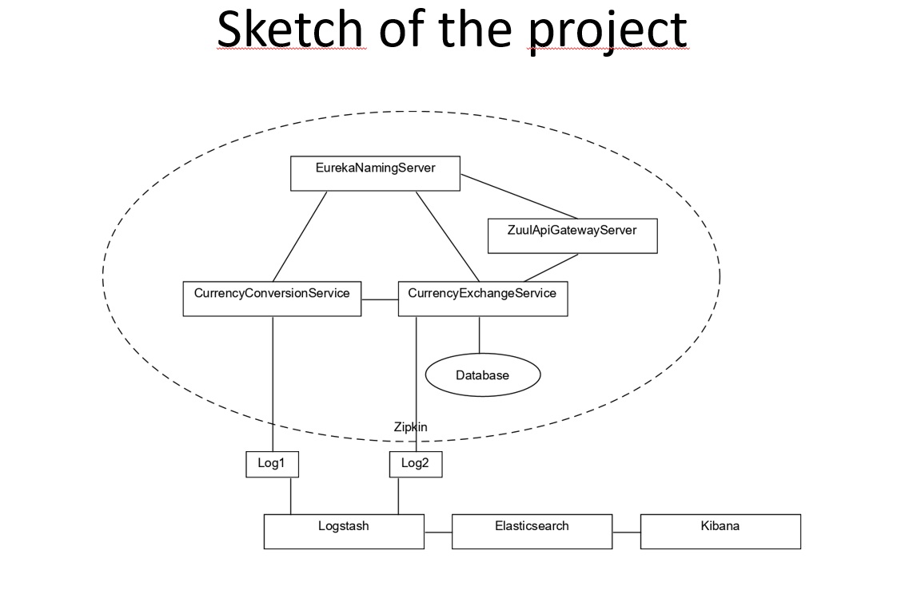
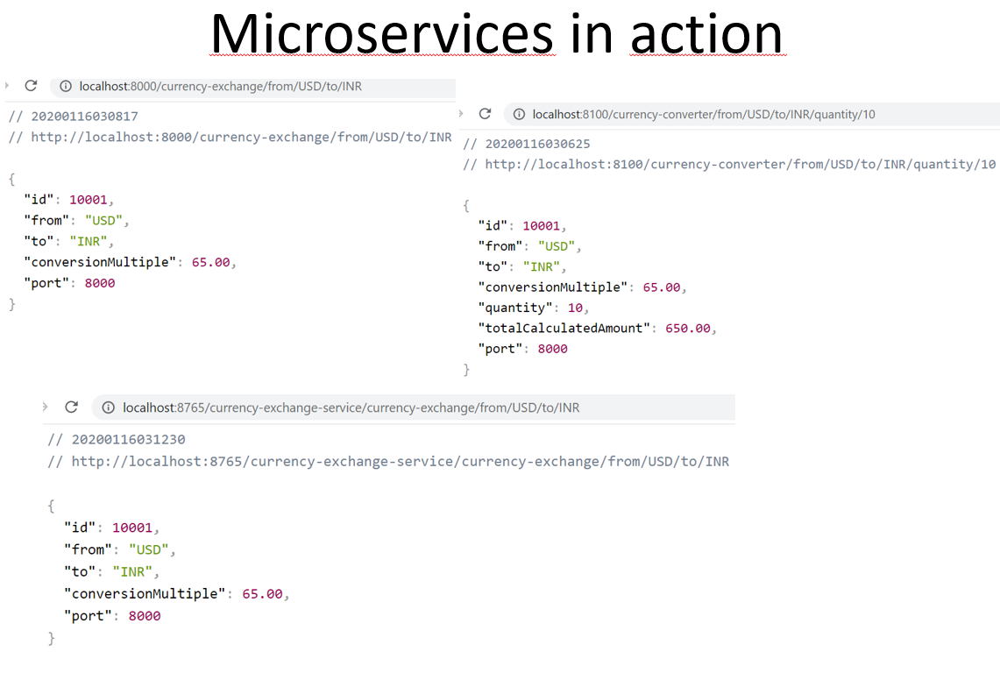
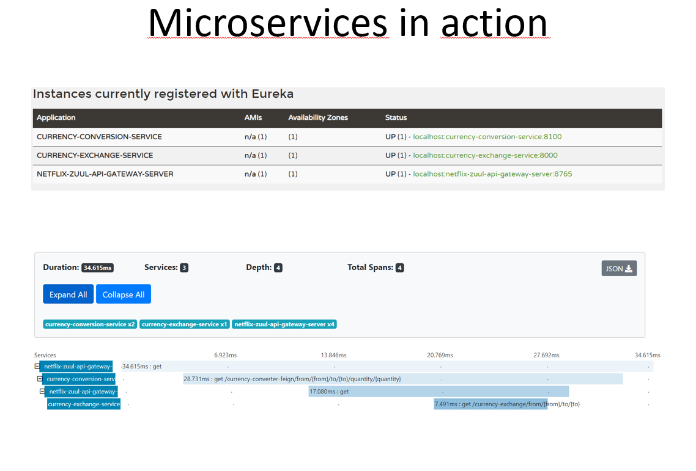
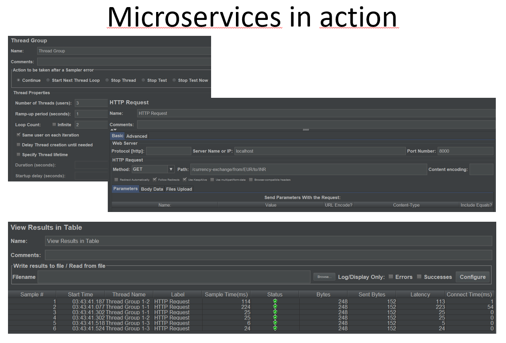
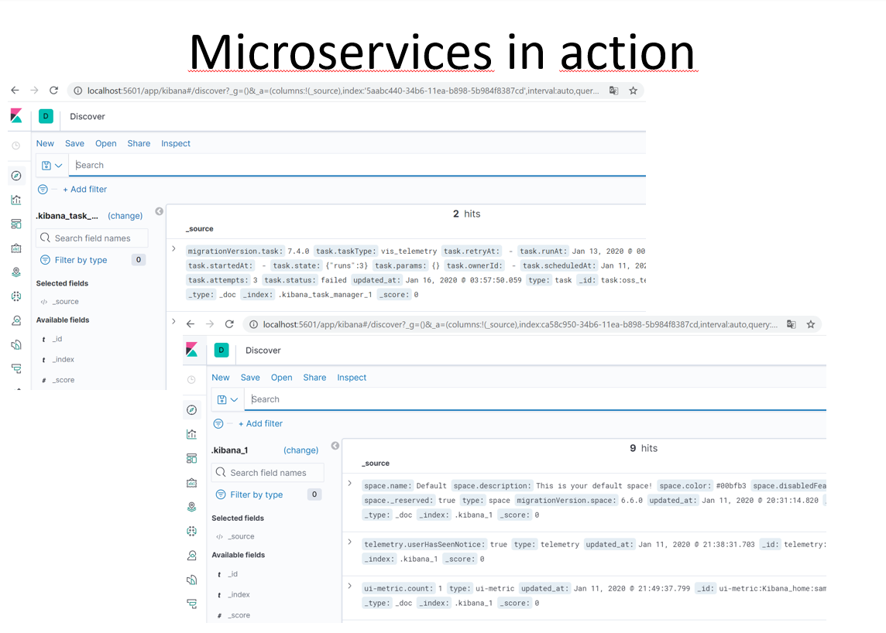

# Microservices
The project practically introduces you to the world of microservices

## Technologies used
*	Spring Cloud
*	Docker – containerize applications
*	Eureka Naming Server and Ribbon – implement dynamic scaling
*	Zuul – implement API Gateway 
*	Spring Cloud Sleuth and Zipkin – implement distributed tracing
*	Jmeter – testing microservices
*	Elasticsearch, Logstash, Kibana (ELK stack) – searching, analyzing and visualizing log data in a real time

## Presentation of the project
 

  

  

  

  

  

  

  

  

  

## How to run a project?
1.	Clone or download a project from github 
2.	Make sure you have the above tools installed (the correct versions can be found in the pom/gradle file)
3.	Open project in IntelliJ IDEA (an Ultimate version may be required)
4.	Run the project and have fun
